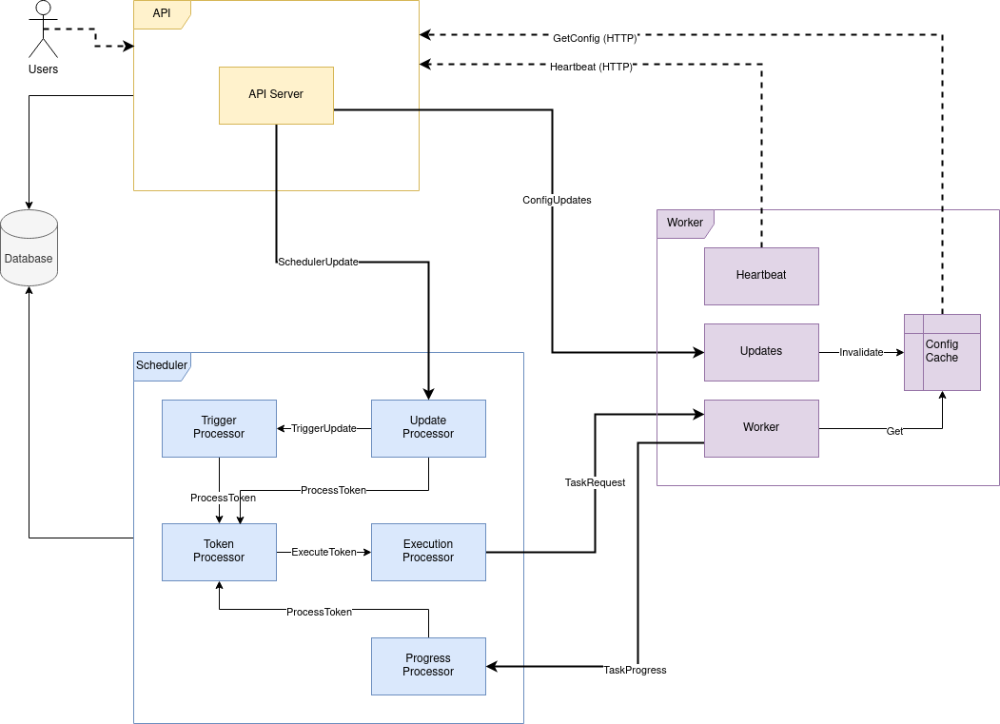

Waterwheel Internals
====================

Waterwheel is composed of three separate processes - the scheduler, worker and API.
These communicate via the message queue (RabbitMQ) and HTTP only. The
scheduler and API access the database (PostgreSQL) to store state, but the
worker has no access to this.

> Originally the scheduler and API were a single process called the server.
> There may still be some accidental references to this in various places.
> The server was split to enable scaling - the scheduler must be a singleton 
> process, whereas the API can be replicated.

## Scheduler

The scheduler itself is composed of several interacting tasks. These 
communicate via channels, and do not share any memory structures.
The tasks use `async` and are executed by the `tokio` multi-threaded runtime.

### Trigger Processor

This is the most complex of all the tasks, and is the most important part of 
Waterwheel.  When this task starts it first loads all the triggers from 
the database, and does a catchup for any that would have fired while it 
wasn't running. It holds the triggers in a priority queue, sorted by the 
next trigger time.  It then enters the scheduler loop:

1. First check if any *Trigger Update* messages are pending.
   If there is an update it removes that trigger from the queue, reloads 
   the trigger's configuration from the database and then puts it back into the 
   queue. There may be multiple updates pending, and they are all processed 
   before moving on.
   
1. If the queue is now empty (because there were no triggers, or the trigger 
   updates removed the last one) then the **Trigger Processor** waits on the 
   *Trigger Update* channel. When an update happens it is handled and then 
   control returns to the start of the scheduler loop.
   
1. Now the queue is not empty, so the next trigger is popped from the queue. 
   The **Trigger Processor** checks if the target time has already passed:
   
    1. If the time has already passed then the trigger is activated, and its 
       next trigger time is re-queued. Control returns to the top of the 
       scheduler loop.
   
    1. If the trigger time has not passed, the **Trigger Processor** will either
       sleep until the target time, or until a *Trigger Update* is received.
        
        1. If the sleep time is reached then the trigger is activated, and its 
           next trigger time is re-queued
          
        1. If a *Trigger Update* is received then the trigger that was being 
           waited for is re-queued, then the updated trigger is handled
           
       In both cases control then returns to the top of the scheduler loop.
    

To activate a trigger the **Trigger Processor** finds each task that depends on 
the trigger and increments its token in the database. Then the trigger's last
trigger time is updated. Finally, it sends an *Increment Token* message to 
the Token Processor for each token.

### Token Processor

The **Token Processor** holds a map of Tokens to counts. This counter is also
stored in the database, but the in memory cache is maintained for simplicity.
The map is populated from the database when the **Token Processor** starts.

The **Token Processor** waits to receive messages from the *Process Token* 
channel. These messages either increment a token, or clear the count back to 
zero.

After incrementing a token if the threshold is reached then a message is 
sent to the *Execute Token* channel, and the threshold is deduced from the 
counter.

After either message the cache is scanned for any tokens that have a count 
of zero: these are discarded.

> Note: the **Token Processor's** cache is basically redundant since the 
> data is stored in the database and when the cache is updated a database 
> query is needed to get the token's threshold anyway.

### Execution Processor

The **Execution Processor** listens for messages from the *Execute Token* 
channel. It sends the task request to RabbitMQ 
to be executed by a worker and then updates the token's counter in the 
database and creates a task run entry.

This process is only separate from the *Token Processor* to keep the logic 
simpler.

### Progress Processor

The **Progress Processor** listens to progress messages from RabbitMQ to 
update the status of running tasks. If the status is *final* (i.e. success, 
failure or error) then the **Progress Processor** activates the downstream 
tasks. This involves checking for task edges in the database and sending an 
increment message to the **Token Processor**. For all status updates it also 
updates the token and the task run entry in the database.

### Update Processor

The **Update Processor** listens for updates from RabbitMQ. These are sent 
from the API when a job is created or edited, or when tasks are manually 
activated by the UI. This process routes these updates to either the 
**Trigger Processor** or the **Token Processor** as needed. 

## API

The **API** listens via HTTP for all API interactions and well as 
serving the Web interface.

The API has methods to get and update all the various objects that 
Waterwheel manages.

When a Job is updated the API will send a *Trigger Update* message over 
RabbitMQ to the **Trigger Processor** which will wake up any sleep and allow 
the potentially modified triggers to be applied immediately. A message is 
sent on the same queue to the **Token Processor** when a task is manually 
activated.

Finally the **API** sends a broadcast message to RabbitMQ when either 
project config or task definitions are edited. This allows the workers to 
invalidate their caches.

## Worker

The worker is much simpler than the scheduler and only runs two distinct tasks.

### Work Processor

The **Work Processor** listens to RabbitMQ for task definitions to execute. 
It then uses either Docker or Kubernetes to execute the task and send the 
results back over RabbitMQ.  This process is created multiple times 
determined by the `WATERWHEEL_MAX_TASKS` variable.

The task definitions are fetched from the **API** via HTTP and cached 
locally. The cache expires after 24 hours, and evicts least recently used 
items when full. The **API** sends invalidation messages over RabbitMQ and 
the Worker subscribes to these.

### Update Processor

The **Update Processor** listens for cache invalidation messages from RabbitMQ. 
These are sent from the API when a job is created or edited, or when a 
project's config is modified. This process deletes the relevant items from 
the in-memory cache so that they will be fetched again if needed.

### Heartbeat

Heartbeats sre sent to the API via HTTP every five seconds with the worker's 
current status. If the API does not respond the worker currently logs a 
warning and continues; it is not a fatal error.
